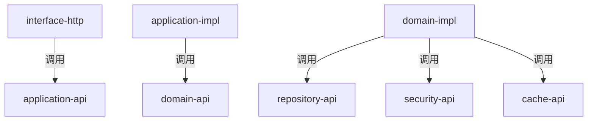
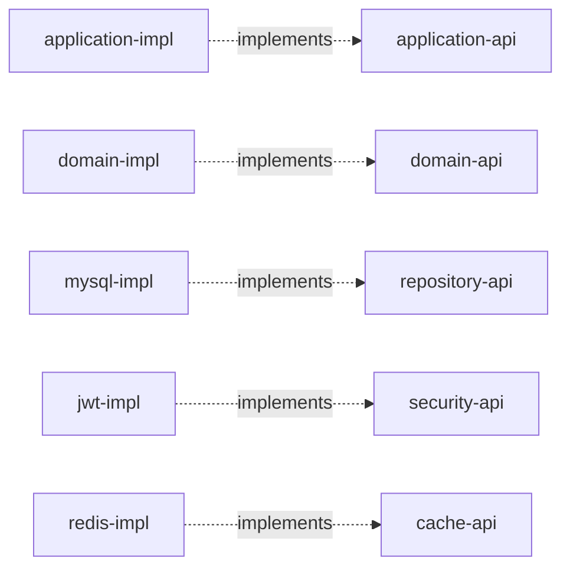

# Awsome Shop Auth Service

用户认证与管理服务 — AWSomeShop 平台的认证中心。

- **Java 21** / **Spring Boot 3.4.1** / **Spring MVC (Servlet)**
- DDD + 六边形架构，26 个 Maven 子模块
- JWT (HS256/JJWT) + bcrypt 密码加密
- MyBatis-Plus 3.5.7 / Flyway / Redis

---

## 核心功能

| 功能 | 端点 | Scope |
|------|------|-------|
| 用户注册 | `POST /api/v1/public/auth/register` | public |
| 用户登录 | `POST /api/v1/public/auth/login` | public |
| Token 验证 | `POST /api/v1/internal/auth/validate` | internal |
| 当前用户 | `POST /api/v1/private/user/current` | private |
| 用户列表 | `POST /api/v1/admin/user/list` | admin |
| 用户详情 | `POST /api/v1/admin/user/get` | admin |
| 更新用户 | `POST /api/v1/admin/user/update` | admin |

---

## 模块结构

```
awsome-shop-auth-service/
├── common/                          # 异常、错误码、Result
├── domain/
│   ├── domain-model/                # UserEntity, Role, UserStatus
│   ├── domain-api/                  # AuthDomainService, UserDomainService
│   ├── domain-impl/                 # 领域服务实现
│   ├── repository-api/              # UserRepository (Port)
│   ├── security-api/                # JwtService, PasswordService (Port)
│   ├── cache-api/                   # 缓存接口 (Port)
│   └── mq-api/                      # 消息队列接口 (Port)
├── infrastructure/
│   ├── repository/mysql-impl/       # UserPO, UserMapper, UserRepositoryImpl
│   ├── cache/redis-impl/            # Redis 配置
│   ├── mq/sqs-impl/                 # SQS 配置
│   └── security/jwt-impl/           # JwtServiceImpl, BcryptPasswordServiceImpl
├── application/
│   ├── application-api/             # DTO + AuthAppService, UserAppService
│   └── application-impl/            # 应用服务实现
├── interface/
│   ├── interface-http/              # AuthController, UserController
│   └── interface-consumer/          # 消息消费者
└── bootstrap/                       # Spring Boot 启动 + Flyway 迁移
```

---

## 模块依赖关系图


### 调用依赖



### 实现依赖



---

## DDD 分层原则

| 原则 | 说明 |
|------|------|
| **Interface → Application** | Controller 只调用 Application Service 接口 |
| **Application → Domain** | 应用服务只调用 Domain Service 接口，不直接依赖 Repository |
| **Domain → Port** | 领域服务通过 Port 接口访问基础设施 |
| **Infrastructure → Port** | 基础设施模块实现 Port 接口，依赖反转 |

---

## 快速开始

```bash
# 1. 启动 MySQL
docker run -d --name mysql-8.4.8 -p 3306:3306 \
  -e MYSQL_ROOT_PASSWORD=root mysql:8.4.8

# 2. 创建数据库
docker exec mysql-8.4.8 mysql -uroot -proot \
  -e "CREATE DATABASE awsome_shop_auth DEFAULT CHARACTER SET utf8mb4;"

# 3. 编译
mvn clean install -DskipTests

# 4. 启动 (Flyway 自动建表 + 种子数据)
mvn spring-boot:run -pl bootstrap -Dspring-boot.run.profiles=local

# 5. 访问 Swagger
open http://localhost:8001/swagger-ui.html
```

### 默认管理员账号

| 用户名 | 密码 | 角色 |
|--------|------|------|
| admin | admin123 | ADMIN |

---

## 架构文档

详见 [docs/architecture.md](docs/architecture.md)

---

## 技术栈

| 技术 | 版本 | 用途 |
|------|------|------|
| Java | 21 | 运行时 |
| Spring Boot | 3.4.1 | 应用框架 (Servlet/MVC) |
| MyBatis-Plus | 3.5.7 | ORM |
| JJWT | 0.12.3 | JWT 签发与验证 |
| spring-security-crypto | - | bcrypt 密码加密 |
| Flyway | - | 数据库迁移 |
| SpringDoc | 2.7.0 | API 文档 |
| Redis | - | 缓存 |
| Lombok | - | 代码简化 |
